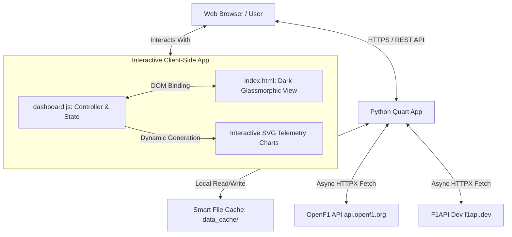

# Formula 1 Data Dashboard 🏎️🏁

A high-performance, asynchronous, and interactive Formula 1 telemetry and statistics dashboard. Powered by the **OpenF1 API** (`https://openf1.org`) and enhanced with additional driver biographical data from `https://f1api.dev/`.

Built on a robust, lightweight Python asynchronous backend (**Quart** + **HTTPX**) and a responsive, high-fidelity frontend (**Vanilla JS** + **Vanilla CSS** + **SVG charting**).

* **Live Deployment:** [https://f1.nagoya-jp.me/](https://f1.nagoya-jp.me/)
* **License:** [MIT License](LICENSE)

---

## 🏗️ Architecture Overview



---

## ✨ Features & Capabilities

Our F1 Dashboard offers standard-setting telemetry analysis and event coverage tools:

### 1. Interactive Comparison Charts (Compare Tab)
* **Lap Times Progression:** Graphically plots the lap times of all selected drivers simultaneously, allowing side-by-side pace assessment.
* **Gap to Leader (Race Only):** Displays the lap-by-lap interval delta between each selected driver and the session leader, illustrating race dynamics and catch-up speed.
* **Grid Position (Race Only):** Tracks driver position shifts from the starting grid to the chequered flag.
* **Head-to-Head Delta:** Compares head-to-head performance by plotting the sector-by-sector/lap-by-lap delta against any selected reference driver.
* **Tyre Strategy Timeline:** Graphically renders tyre compound stints for multiple selected drivers on a unified timeline, highlighting strategic overlaps and pit windows.
* **Outlier & Pit Filtering:** Toggle to automatically exclude pit stops and slow-down laps (safety cars, yellow flags, in-laps) to expose pure race pace.
* **Interactive Zoom & Pan:** Scroll to zoom and click-drag to pan through dense lap datasets, with an instant **Reset Zoom** button.

### 2. Deep Dive Driver Telemetry (Laps & Stints Tab)
* **Tire Stints Timeline:** Proportional, color-coded horizontal bars visualizing stints on Soft (Red), Medium (Yellow), Hard (White), Intermediate (Green), and Wet (Blue) compounds.
* **Individual Lap Progression Chart:** Renders an SVG line chart of the driver's lap time trajectory with outlier filtering.
* **All Lap Times Table:** Breaks down every single lap into Sector 1, Sector 2, Sector 3, pit stops, and highlights the fastest lap in the session.
* **Profile Header:** Displays driver headshots, official team colors, nationality flags, team names, age at the date of the race, and direct Wikipedia links.

### 3. Session & Event Browser (Sidebar)
* **Year Selector:** Navigate historical data from **2023, 2024, 2025**, and live **2026** seasons.
* **Smart Filter & Search:** Instantly search by Grand Prix/circuit name. Filter by session type pills: **Race**, **Qualifying**, and **Practice**.
* **Include Cancelled:** Toggle to show/hide cancelled sessions.
* **Smart Focus:** Automatically scrolls to and highlights the currently active session during a race weekend.

### 4. Real-time Incident & Race Feed (Race Control Tab)
* Live chronological feeds of race control decisions, warnings, safety cars, investigations, and penalties.
* Toggle to filter out blue flags to focus on critical incidents.

### 5. Official Session Results (Results Tab)
* Displays the final driver standings, grid positions, total laps completed, time/gaps, race status (Finished, DNF, DNS), and championship points awarded.
* **Championship Progression Chart:** Cumulative points per round across the season as team-colored SVG line charts, switchable between Drivers and Constructors, with per-round tooltips and dashed lines to distinguish teammates.

### 6. Weather Telemetry Widget
* Aggregates live track and air temperature, humidity levels, wind speed, and outputs rainfall warnings.

### 7. Circuit Details & Layout Maps
* Details the official event name, local timezone offsets, start/end dates, and renders dynamic SVG/image representations of the track layouts.

### 8. Enterprise-grade API Cache Engine
* Protects OpenF1 API usage and speeds up load times with flat-file JSON caching:
  * **Historical Data (Ended > 24 hours ago):** Cached permanently.
  * **Active / Upcoming Sessions:** 5-minute Time-To-Live (TTL).
  * **Session Listings:** 1-hour TTL.
  * **Stale Fallback:** Serves expired cache files gracefully if the external API experiences downtime.

### 9. Bypassing Live Restrictions
* Bypasses live session restrictions during race weekends by letting users input their own OpenF1 API key directly in the UI settings panel. Keys are stored in the browser's `localStorage` and sent via requests.

---

## 🛠️ Tech Stack & Dependencies

* **Backend Framework:** [Quart](https://github.com/pgjones/quart) (Asynchronous Flask alternative)
* **HTTP Client:** [HTTPX](https://github.com/encode/httpx) (Asynchronous HTTP requests)
* **Frontend Design:** Vanilla CSS with custom design tokens for a premium Dark Glassmorphic look.
* **Frontend Controller:** Vanilla JavaScript (ES6+, async/await architecture, raw SVG rendering).
* **Testing:** Python `unittest` executing node tests internally.

---

## 🚀 Getting Started

### Prerequisites
* Python 3.9+ (Python 3.14+ recommended)
* Node.js (for running the frontend test suite)

### Installation
1. Clone this repository:
   ```bash
   git clone https://github.com/baha2046/f1dashbroad.git
   cd f1dashbroad
   ```

2. Initialize and activate a Python virtual environment:
   ```bash
   python3 -m venv .venv
   source .venv/bin/activate
   ```

3. Install required packages:
   ```bash
   pip install -r requirements.txt
   ```

4. Run the web server:
   ```bash
   python app.py
   ```
   The application will run locally at [http://localhost:5300/](http://localhost:5300/).

---

## 🧪 Testing

The dashboard contains a comprehensive test suite in [tests/](tests/) using Python's built-in `unittest` library. Some tests execute JavaScript helper fragments via a Node.js subprocess to verify core client-side functions in `dashboard.js`.

To run all tests:
```bash
.venv/bin/python3 -m unittest discover -s tests
```

---

## 📂 Project Directory Structure

```
├── .gitignore
├── AGENTS.md                 # Agent-specific instructions and rules
├── LICENSE                   # MIT License
├── README.md                 # This document
├── app.py                    # Quart backend (API endpoints, routing, cache engine)
├── requirements.txt          # Python dependencies
├── ubuntu-apache-deployment-guide.md # Production deployment guide
├── data_cache/               # Local JSON cache folder (automatically created)
├── doc/                      # Implementation & design specification history
├── templates/
│   └── index.html            # Main dashboard HTML template
├── static/
│   ├── css/
│   │   └── styles.css        # Glassmorphic styles, grid layouts, and F1 team themes
│   └── js/                   # Ordered scripts sharing the global scope (split of the former dashboard.js)
│       ├── 01-state-helpers.js   # App state, constants, formatting helpers
│       ├── 02-dom.js             # DOM element references
│       ├── 03-api-settings.js    # customFetch, banners, API key panel, event wiring
│       ├── 04-sessions-sidebar.js # Session list, search/filter, autofocus
│       ├── 05-session-load.js    # Session selection, data loading, qualifying/pit helpers
│       ├── 06-overview-tabs.js   # Header, weather, circuit, results, standings, race control
│       ├── 07-driver-grids.js    # Drivers grid, laps sidebar, compare selector
│       ├── 08-compare-charts.js  # Compare tab SVG chart engine
│       └── 09-laps-tab.js        # Laps & stints tab, lap chart
└── tests/                    # Backend and JS-interop unit tests
```

---

## 📑 Implementation & Design Specifications
All feature-specific design notes and execution plans are preserved in the [doc/](doc/) directory:
* **Session Autofocus:** [doc/2026-06-30-session-autofocus-note.md](doc/2026-06-30-session-autofocus-note.md)
* **Lap Comparison:** [doc/2026-06-29-compare-lap-progression-design.md](doc/2026-06-29-compare-lap-progression-design.md) & [plan](doc/2026-06-29-compare-lap-progression-plan.md)
* **Pit Annotations:** [doc/2026-06-29-pit-lap-annotations-design.md](doc/2026-06-29-pit-lap-annotations-design.md) & [plan](doc/2026-06-29-pit-lap-annotations-plan.md)
* **UX Review of Charts:** [doc/2026-07-01-compare-charts-ux-design.md](doc/2026-07-01-compare-charts-ux-design.md)
* **Gap to Leader Telemetry:** [doc/2026-07-01-compare-gap-to-leader-plan.md](doc/2026-07-01-compare-gap-to-leader-plan.md)
* **New Comparison Metrics:** [doc/2026-07-01-compare-new-metrics-design.md](doc/2026-07-01-compare-new-metrics-design.md)
* **Driver Card Improvements:** [doc/2026-07-03-enhance-drivers-tab-design.md](doc/2026-07-03-enhance-drivers-tab-design.md) & [plan](doc/2026-07-03-enhance-drivers-tab-plan.md)

---

## 📝 License
This project is licensed under the terms of the MIT License. See [LICENSE](LICENSE) for full details.
