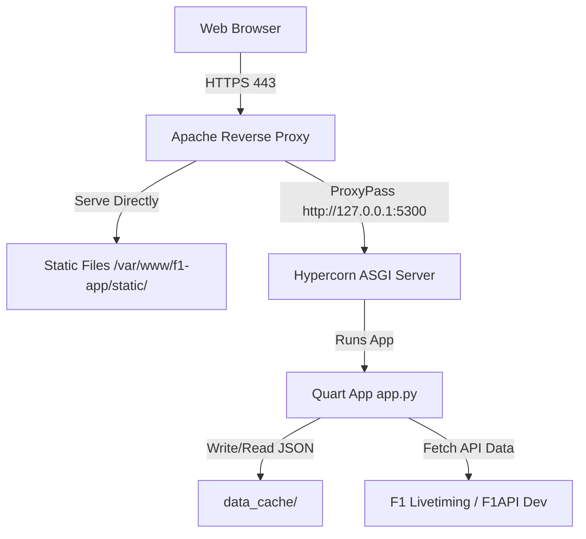

# Ubuntu and Apache Deployment Guide for F1 Quart Application

This guide provides step-by-step instructions on how to deploy the F1 Quart web application to a Virtual Private Server (VPS) running **Ubuntu** (22.04 LTS or 24.04 LTS) and **Apache HTTP Server**.

As an asynchronous Python application built on Quart (see [app.py](file:///Users/ericchan/IdeaProjects/F1/app.py)), the application is served in production using an ASGI server (**Hypercorn**), managed by **systemd** as a background service, and reverse-proxied by **Apache** (via `mod_proxy`) on ports `80` and `443`.

---

## Architecture Overview



---

## Prerequisites

- A VPS running Ubuntu (e.g., 22.04/24.04 LTS) with public IP.
- A domain name (e.g., `f1.example.com`) pointed to your VPS IP address (DNS A Record).
- SSH access to your VPS with `sudo` privileges.

---

## Step 1: Update System and Install Dependencies

Connect to your VPS via SSH and update the system package lists:

```bash
sudo apt update && sudo apt upgrade -y
```

Next, install Apache, Python 3, virtual environment tools, and Git:

```bash
sudo apt install apache2 python3-pip python3-venv python3-dev git -y
```

---

## Step 2: Deploy Code and Set Up Virtual Environment

1. Clone or copy your application files to `/var/www/f1-app`:
   ```bash
   sudo git clone https://github.com/baha2046/f1dashbroad.git /var/www/f1-app
   ```
   *(Alternatively, copy files over SFTP/SCP to `/var/www/f1-app`.)*

2. Change ownership of the directory to your deployment user or standard administrator user to install dependencies, then later adjust permissions for the web server user:
   ```bash
   sudo chown -R $USER:$USER /var/www/f1-app
   ```

3. Navigate to the application root and create a Python virtual environment:
   ```bash
   cd /var/www/f1-app
   python3 -m venv .venv
   ```

4. Activate the virtual environment and install the required dependencies (from [requirements.txt](file:///Users/ericchan/IdeaProjects/F1/requirements.txt)) along with **Hypercorn** (the production-grade ASGI server):
   ```bash
   source .venv/bin/activate
   pip install --upgrade pip
   pip install -r requirements.txt
   pip install hypercorn
   ```

---

## Step 3: Configure Cache Directory Permissions

The application caches API data under the [data_cache/](file:///Users/ericchan/IdeaProjects/F1/data_cache) directory. The systemd service runs the app under the `www-data` group (or user). We must ensure the app has permission to write to this directory.

Create the cache directory if it doesn't exist and set the group/user permissions:

```bash
mkdir -p /var/www/f1-app/data_cache
sudo chgrp -R www-data /var/www/f1-app/data_cache
sudo chmod -R 775 /var/www/f1-app/data_cache
```

---

## Step 4: Configure systemd Process Management

To ensure the application runs continuously, starts automatically on system reboot, and restarts if it crashes, configure it as a **systemd** service.

1. Create a systemd service definition file:
   ```bash
   sudo nano /etc/systemd/system/f1-app.service
   ```

2. Add the following configuration (replace `www-data` with your dedicated deployment user if using one):
   ```ini
   [Unit]
   Description=F1 Quart Application
   After=network.target

   [Service]
   User=www-data
   Group=www-data
   WorkingDirectory=/var/www/f1-app
   Environment="PATH=/var/www/f1-app/.venv/bin"
   ExecStart=/var/www/f1-app/.venv/bin/hypercorn --bind 127.0.0.1:5300 --workers 2 app:app
   Restart=always
   RestartSec=5

   [Install]
   WantedBy=multi-user.target
   ```

3. Save and close the file (`Ctrl+O`, `Enter`, `Ctrl+X`).

4. Reload systemd, start the service, and enable it to start on boot:
   ```bash
   sudo systemctl daemon-reload
   sudo systemctl start f1-app
   sudo systemctl enable f1-app
   ```

5. Verify the service is running successfully:
   ```bash
   sudo systemctl status f1-app
   ```

---

## Step 5: Configure Apache as a Reverse Proxy

Apache will handle incoming client connections, serve static assets directly (for optimal performance), and pass all other requests to the backend Hypercorn server running on `127.0.0.1:5300`.

1. Enable the Apache proxy and header modules:
   ```bash
   sudo a2enmod proxy
   sudo a2enmod proxy_http
   sudo a2enmod headers
   ```

2. Create an Apache configuration file for the site:
   ```bash
   sudo nano /etc/apache2/sites-available/f1-app.conf
   ```

3. Add the virtual host configuration (replace `f1.example.com` with your actual domain):
   ```apache
   <VirtualHost *:80>
       ServerName f1.example.com
       ServerAlias www.f1.example.com

       # Serve static files directly through Apache for high speed
       Alias /static /var/www/f1-app/static
       <Directory /var/www/f1-app/static>
           Require all granted
           Options -Indexes +FollowSymLinks
       </Directory>

       # Proxy setup to Hypercorn ASGI
       ProxyRequests Off
       ProxyPreserveHost On
       ProxyVia Full

       <Proxy *>
           Require all granted
       </Proxy>

       # Pass all non-static requests to Hypercorn
       ProxyPass /static !
       ProxyPass / http://127.0.0.1:5300/
       ProxyPassReverse / http://127.0.0.1:5300/

       # Logging configuration
       ErrorLog ${APACHE_LOG_DIR}/f1-app_error.log
       CustomLog ${APACHE_LOG_DIR}/f1-app_access.log combined
   </VirtualHost>
   ```

4. Enable the new site configuration and disable the default site:
   ```bash
   sudo a2ensite f1-app.conf
   sudo a2dissite 000-default.conf
   ```

5. Test the configuration for syntax errors:
   ```bash
   sudo apache2ctl configtest
   ```
   *Output should say `Syntax OK`.*

6. Restart Apache to apply the configuration:
   ```bash
   sudo systemctl restart apache2
   ```

---

## Step 6: Secure with SSL (HTTPS) via Let's Encrypt

Using HTTPS is required for modern web applications. We can obtain a free certificate using Certbot.

1. Install Certbot and the Apache plugin:
   ```bash
   sudo apt install certbot python3-certbot-apache -y
   ```

2. Run Certbot to acquire and install the SSL certificate:
   ```bash
   sudo certbot --apache -d f1.example.com -d www.f1.example.com
   ```
   Follow the prompts to enter an email address, accept terms, and configure redirection (recommended: choose option to automatically redirect all HTTP traffic to HTTPS).

3. Verify that the automatic renewal timer is active:
   ```bash
   sudo systemctl status certbot.timer
   ```

---

## Step 7: Firewall and Security Settings

Ensure the firewall is enabled and only allows traffic through SSH and web ports.

1. Configure the Ubuntu Firewall (UFW):
   ```bash
   sudo ufw default deny incoming
   sudo ufw default allow outgoing
   sudo ufw allow OpenSSH
   sudo ufw allow 'Apache Full'
   sudo ufw enable
   ```

2. Check status:
   ```bash
   sudo ufw status
   ```

---

## Troubleshooting and Maintenance

### Viewing Application Logs
To view the output/errors generated by the Python/Quart application:
```bash
sudo journalctl -u f1-app -f
```

### Viewing Apache Logs
For Apache server-side errors or access patterns:
- Error logs: `sudo tail -f /var/log/apache2/f1-app_error.log`
- Access logs: `sudo tail -f /var/log/apache2/f1-app_access.log`

### Updating the Application
When deploying code updates:
1. Navigate to `/var/www/f1-app` and fetch latest changes (or upload new files).
2. Activate `.venv` and install new requirements if modified:
   ```bash
   git pull origin main
   source .venv/bin/activate
   pip install -r requirements.txt
   ```
3. Restart the background service to reload the Quart application:
   ```bash
   sudo systemctl restart f1-app
   ```
4. Clear caching issues if needed by deleting files in [data_cache/](file:///Users/ericchan/IdeaProjects/F1/data_cache):
   ```bash
   rm -f /var/www/f1-app/data_cache/*
   ```

> **Note:** When upgrading from an OpenF1-based build to the F1 Livetiming build, clearing `data_cache/` is **required**, not optional. Cached sessions, meetings, laps, telemetry and replay files from the old build use different session keys and timestamps, and files for completed sessions never expire on their own.
